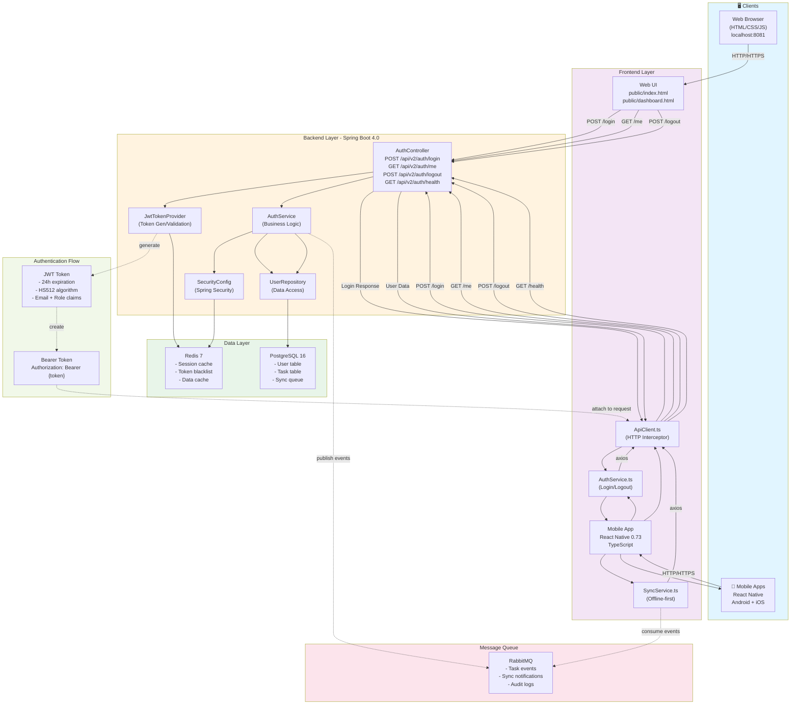

# Preset CTO - System Architecture Diagram

## Overview



## Component Descriptions

### Clients Layer
- **Web Browser** — HTML/CSS/JS fallback UI (localhost:8081)
- **Mobile Apps** — React Native (Android + iOS)

### Frontend Layer
- **AuthService** — Handles login/logout with smart backend/mock fallback
- **ApiClient** — Axios HTTP client with JWT interceptors
- **SyncService** — Offline-first sync engine with queue management
- **Redux Store** — Centralized state (auth, sync)

### Backend Layer (Spring Boot 4.0)
- **AuthController** — REST endpoints for authentication
- **AuthService** — Business logic for auth operations
- **JwtTokenProvider** — JWT token generation and validation
- **SecurityConfig** — Spring Security configuration
- **UserRepository** — JPA data access layer

### Data Layer
- **PostgreSQL 16** — User, Task, and Sync queue tables
- **Redis 7** — Session cache, token blacklist, data cache

### Message Queue
- **RabbitMQ** — Event publishing for task events and sync notifications

### Authentication Flow
1. Client sends credentials → POST /api/v2/auth/login
2. Backend validates credentials via UserRepository
3. JwtTokenProvider generates JWT token (HS512, 24h expiration)
4. Response includes token + user data
5. Client stores token in AsyncStorage
6. Subsequent requests include: `Authorization: Bearer {token}`
7. SecurityConfig validates token via JwtTokenProvider
8. UserDetailsService loads user from database

---

## Data Flow Examples

### Login Flow
```
User Input (email/password)
    ↓
LoginScreen.tsx
    ↓
AuthService.login()
    ↓
ApiClient.post(/api/v2/auth/login)
    ↓
AuthController.login()
    ↓
AuthService_BE.authenticate()
    ↓
UserRepository.findByEmail()
    ↓
PostgreSQL (password check)
    ↓
JwtTokenProvider.generateToken()
    ↓
Response: { token, user }
    ↓
AsyncStorage.setItem('token')
    ↓
Redux authSlice.setUser()
    ↓
Navigate to Dashboard
```

### Offline-First Sync Flow
```
User creates/updates task (offline)
    ↓
SyncService.addToQueue()
    ↓
Redux syncSlice.addPending()
    ↓
UI shows optimistic update
    ↓
[ONLINE] NetInfo detects connection
    ↓
SyncService.syncWithServer()
    ↓
ApiClient.post(/api/v2/sync/push)
    ↓
Backend processes changes
    ↓
RabbitMQ publishes update event
    ↓
ApiClient.get(/api/v2/sync/pull)
    ↓
Response with remote changes
    ↓
Redux syncSlice.resolveConflicts()
    ↓
PostgreSQL updated locally
    ↓
UI synchronized with server
```

### API Request with JWT
```
ApiClient.get('/api/v2/auth/me')
    ↓
Interceptor: add Authorization header
    Authorization: Bearer eyJhbGc...
    ↓
Spring Security Filter Chain
    ↓
BearerTokenFilter extracts token
    ↓
JwtTokenProvider.validateToken()
    ↓
SecurityContext.setAuthentication()
    ↓
AuthController.getMe()
    ↓
UserRepository.findById()
    ↓
Response: { email, role, createdAt }
```

---

## Technology Stack by Layer

| Layer | Technology | Version |
|-------|-----------|---------|
| **Frontend** | React Native | 0.73.0 |
| **Frontend** | TypeScript | 5.3.3 |
| **Frontend** | Redux Toolkit | 1.9.7 |
| **Frontend** | Axios | 1.6.5 |
| **Backend** | Spring Boot | 4.0.0 |
| **Backend** | Java | 21 LTS |
| **Backend** | Spring Security | 6.1 |
| **Backend** | Spring Data JPA | 6.1 |
| **Backend** | JWT (jjwt) | 0.12.3 |
| **Database** | PostgreSQL | 16 |
| **Cache** | Redis | 7 |
| **Queue** | RabbitMQ | Latest |
| **Build (Frontend)** | npm | ≥9.0.0 |
| **Build (Backend)** | Maven | 3.11.0 |

---

## Security Layers

```
┌─────────────────────────────────────────┐
│          HTTPS/TLS Encryption            │
├─────────────────────────────────────────┤
│      JWT Token Authentication           │
│  (Bearer token in Authorization header) │
├─────────────────────────────────────────┤
│      Spring Security Filters             │
│  (Validation, Authorization)             │
├─────────────────────────────────────────┤
│      Role-Based Access Control           │
│  (RBAC: ADMIN, USER, GUEST)             │
├─────────────────────────────────────────┤
│      Database-Level Security             │
│  (Password hashing: Bcrypt)             │
├─────────────────────────────────────────┤
│      AsyncStorage Protection             │
│  (OS-level encryption)                   │
└─────────────────────────────────────────┘
```

---

**Last Updated:** December 14, 2025 | Version: 1.0.2
