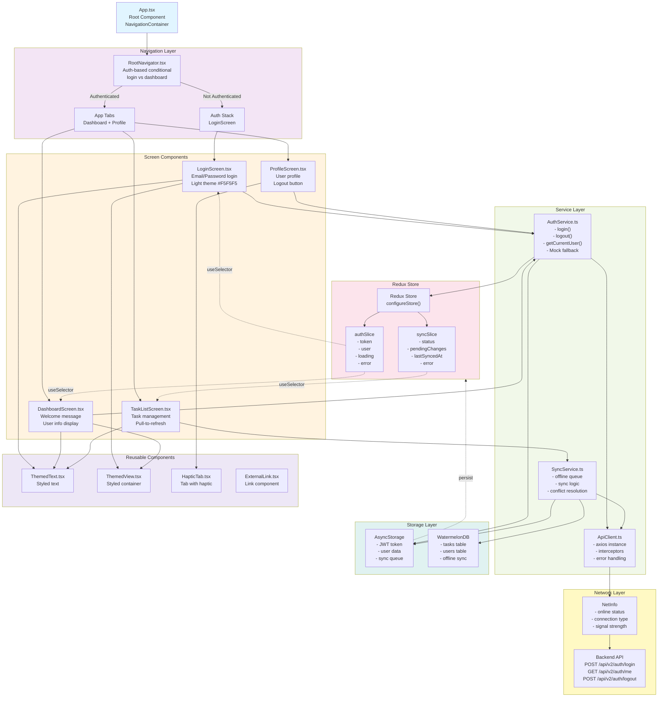
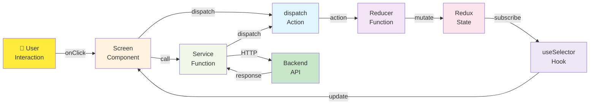
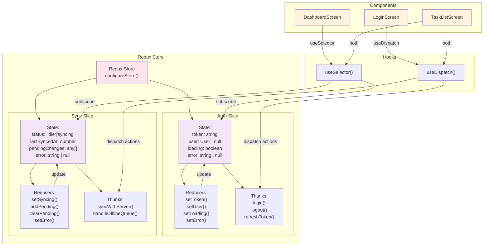
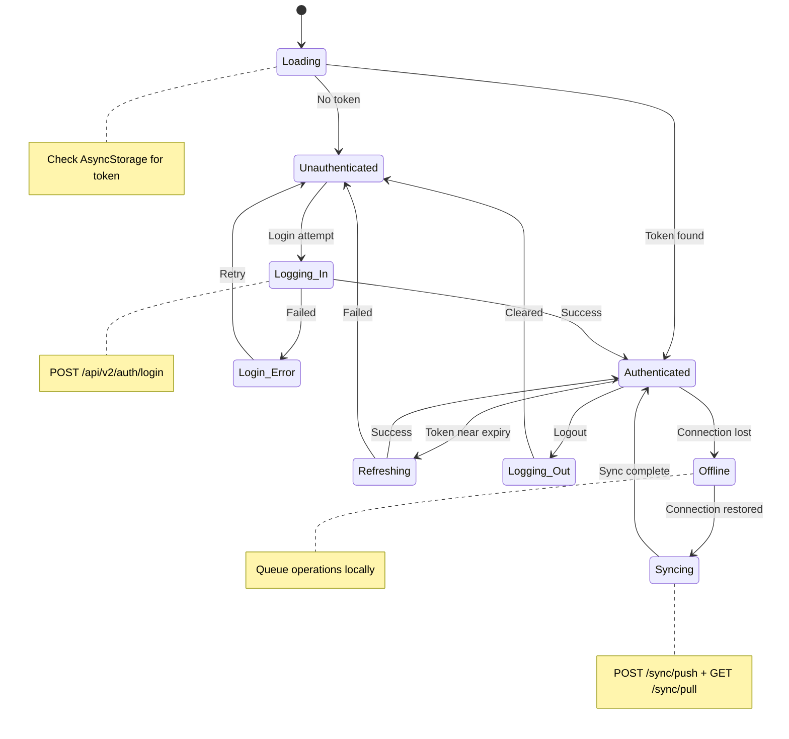

# Preset CTO - Component Architecture (Mobile)

## React Native Component Hierarchy



## Data Flow in Components



## File Organization

```
mobile/
├── src/
│   ├── screens/
│   │   ├── LoginScreen.tsx          # Login form + authentication
│   │   ├── LoginScreen.web.tsx      # Web-specific login
│   │   ├── DashboardScreen.tsx      # Welcome + user info
│   │   ├── ProfileScreen.tsx        # User profile + logout
│   │   ├── TaskListScreen.tsx       # Task management
│   │   └── index.ts                 # Exports
│   │
│   ├── navigation/
│   │   ├── RootNavigator.tsx        # Main navigation logic
│   │   ├── types.ts                 # Navigation types
│   │   └── index.ts                 # Exports
│   │
│   ├── store/
│   │   ├── index.ts                 # Store setup
│   │   └── slices/
│   │       ├── authSlice.ts         # Auth state logic
│   │       └── syncSlice.ts         # Sync state logic
│   │
│   ├── services/
│   │   ├── ApiClient.ts             # Axios HTTP client
│   │   ├── AuthService.ts           # Auth business logic
│   │   └── SyncService.ts           # Offline-first sync
│   │
│   ├── components/
│   │   ├── themed-text.tsx          # Reusable text
│   │   ├── themed-view.tsx          # Reusable container
│   │   ├── haptic-tab.tsx           # Tab with feedback
│   │   └── external-link.tsx        # Link component
│   │
│   ├── types/
│   │   ├── auth.ts                  # Auth interfaces
│   │   ├── sync.ts                  # Sync interfaces
│   │   └── index.ts                 # Exports
│   │
│   ├── constants/
│   │   └── theme.ts                 # Colors & styles
│   │
│   ├── hooks/
│   │   ├── use-color-scheme.ts      # Theme hook
│   │   └── use-theme-color.ts       # Color hook
│   │
│   ├── utils/
│   │   └── helpers.ts               # Helper functions
│   │
│   ├── App.tsx                      # App root
│   └── index.js                     # Entry point
│
├── public/
│   ├── index.html                   # Web login UI
│   ├── dashboard.html               # Web dashboard UI
│   └── favicon.png
│
├── metro.config.js                  # Metro bundler
├── tsconfig.json                    # TypeScript config
├── eslint.config.js                 # ESLint rules
├── package.json
└── README.md
```

## State Management Flow



## Authentication States



---

**Last Updated:** December 14, 2025 | Version: 1.0.2
